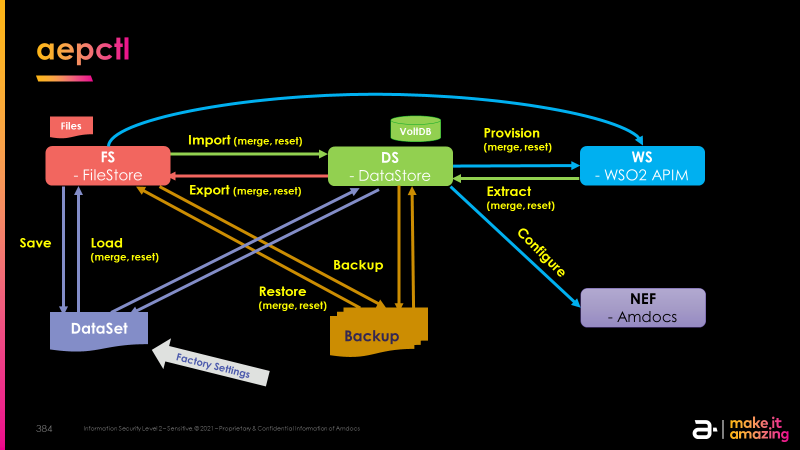
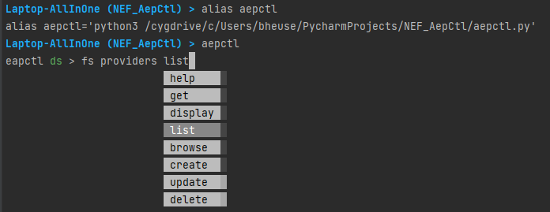
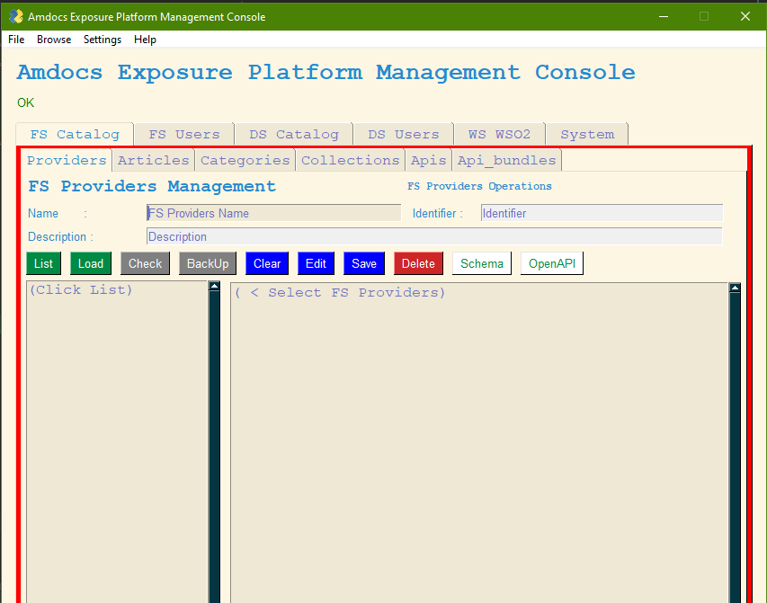

# aepctl overview

A utility to manage the Amdocs Exposure Platform, in the flavour of kubectl and apictl for wso2

- Command line interface, interactive prompt, basic ui, server
- Manage datastore, api gateway, nef services
- Back up and restore



`aepectl` is a command line interface for running commands against Amdocs Exposure Platforms.
This overview covers `aepectl` syntax, describes the command operations, and provides common 
examples. For details about each command, including all the supported flags and subcommands, 
see the `aepectl` reference documentation. For installation instructions see installing `aepectl`.

### Syntax
Use the following syntax to run `aepectl` commands from your terminal window:

`aepectl [flags] [service] [resource] [command] [identifier] [payload]`

    $ alias aepctl='python3 /cygdrive/c/Users/bheuse/PycharmProjects/NEF_AepCtl/aepctl.py'
    $ aepctl ds list providers 
    $ aepctl ws list categories

Where: 

- `flags` : -v for verbose logs, -h for help / usage, -c <file> to use an alternative configuration file.
- `service`: specifies the service to address the command to. 
   `fs` for the local file datastore, 
   `ds` for the remote rest datastore 
   `ws` for the api manager entities, 
- `command`: specifies the operation that you want to perform on one or more resources, 
    for example list, create, get, describe, delete. 
- `resource`: specifies the entities on which the command applies,
    for providers, apis, categories. 
- `identifier`: specifies the identifier of the entry the command applies on. 
    It can be the UUID or the primary key 
- `payload`: specifies the content of an entry. 
    For example : `$ aepctl ws categories create Finance "The Financial Servcie APIs"`
    A file can also be specified : `$ aepctl ws providers Finance -p finance.json`

###  Resources Objects
#### DataStores :
    CATALOG = ["PROVIDERS", "ARTICLES", "CATEGORIES", "COLLECTIONS", "APIS", "API_BUNDLES"]
    APPLICATION_PROFILES = ["ACCOUNTS", "SERVICES", "CONTACTS", "ROLES", "INDUSTRIES", "USECASES"]
    SUBSCRIPTION = ["SUBSCRIPTIONS", "API_CONSUMERS"]
#### WS :
    APIM = ["APIS", "POLICIES", "CATEGORIES", "PRODUCTS"]
    DEVM = ["APPLICATIONS", "SUBSCRIPTIONS"]
    ADM  = ["USERS", "SETTINGS"]

## Interactive Prompt

An interactive version is available, that prompt for commands and support command completion and history.

    $ aepctl        



   `apctl ds > verbose`    # for debug logs

   `eapctl ds > exit` # to exit

   `eapctl ds > config` # to see the configuration 

## Basic UI

    $ aepctlui



## Configuration File

On the first execution, a default configuration file is created in `~/.aepctl/AEPCTL_Configuration.json`

The addresses of the servers can be specified in this file :

    "WSO2_SERVER": "https://localhost:9443",
    "CATALOG_SERVER": "http://localhost:32106",
    "USERS_SERVER": "http://localhost:32107",

## Building an executable

`aepctl` is written in python. 

A self-contained executable can be generated using `build.bat` or build.sh. 
The UI requires an X server in Linux for display.

## aepctl reference

`TO BE COMPLETED`

## installing aepctl 

`TO BE COMPLETED`


AF-DEMO Instructions : NEF-330


# WSO2 API Manager Portals

WSO2 API Manager Portals are accessible here, on localhost:

- [API Manager Management Console](https://localhost:9443/carbon/)
- [API Manager Publisher Portal](https://localhost:9443/publisher)
- [API Manager Developer Portal](https://localhost:9443/devportal)

# WSO2 API Manager APIs

WSO2 API Manager APIs are documented here:

- [WSO2 Admin Portal Rest API](https://apim.docs.wso2.com/en/latest/reference/product-apis/admin-apis/admin-v2/admin-v2/)
- [WSO2 Publisher Rest API](https://apim.docs.wso2.com/en/latest/reference/product-apis/publisher-apis/publisher-v2/publisher-v2/)
- [WSO2 Developer Portal Rest API](https://apim.docs.wso2.com/en/latest/reference/product-apis/devportal-apis/devportal-v2/devportal-v2/)
- [WSO2 Users and Roles Soap API](https://docs.wso2.com/display/IS580/Managing+Users+and+Roles+with+APIs)

# WSO2 API Manager 

## API Control Command Line

`apictl` is the Wso2 equivalent of kubectl for K8S. 

Download from [previous-releases](https://wso2.com/api-management/previous-releases/), select Tooling / CLI

```
$ ./apictl.exe add env production --apim https://localhost:9443
$ ./apictl.exe login production -u admin -p admin -k
```

## WSO2 Management using APIs 

### WSO2 API Manager APIs
- [WSO2 Admin Portal Rest API](https://apim.docs.wso2.com/en/latest/reference/product-apis/admin-apis/admin-v2/admin-v2/)
- [WSO2 Publisher Rest API](https://apim.docs.wso2.com/en/latest/reference/product-apis/publisher-apis/publisher-v2/publisher-v2/)
- [WSO2 Developer Portal Rest API](https://apim.docs.wso2.com/en/latest/reference/product-apis/devportal-apis/devportal-v2/devportal-v2/)
- [WSO2 Users and Roles Soap API](https://docs.wso2.com/display/IS580/Managing+Users+and+Roles+with+APIs)

### Examples:
1. [Obtain the consumer key/secret key pair](examples/rest-api/1.auth1.sh) ([Content](examples/rest-api/auth.json))
2. [Obtain the access token (use the above client id and secret)](examples/rest-api/2.auth2.sh)
3. [Create a Subscription level throttling policy](examples/rest-api/3.policy-create.sh) ([Content](examples/rest-api/policy-create.json))
4. [Create a new API](examples/rest-api/4.api-create.sh) ([Content](examples/rest-api/api-create.json))
5. [Update the swagger definition of the created API](examples/rest-api/5.api-update-def.sh)
6. [Create a new API revision](examples/rest-api/6.rev-create.sh) ([Content](examples/rest-api/rev-create.json))
7. [Deploy the created revision](examples/rest-api/7.deploy.sh) ([Content](examples/rest-api/deploy.json))
8. [Publish the created API](examples/rest-api/8.publish.sh)
9. [Create a new application](examples/rest-api/9.app-create.sh) ([Content](examples/rest-api/app-create.json))
10. [Create a new subscription providing for the created API and the created application](examples/rest-api/10.subscribe.sh) ([Content](examples/rest-api/subscribe.json))
11. [Generate keys (Consumer key/secret) for application](examples/rest-api/11.generate-app-keys.sh) ([Content](examples/rest-api/generate-app-keys.json))
12. [Send test request to created API and Application](examples/rest-api/12.test.sh)
13. [Create a new user Soap](examples/soap-api/1.adduser.sh) ([Content](examples/soap-api/adduser.xml))

### Steps to get access to WSO2 installation in AWS:

```
> This is Phase 1 instructions 
```

1. Login on Amdocs VPN 
2. Login on Openet VPN
3. Initially need to install kubectl if it’s not installed yet
4. To configure access to K8S need to put file eks-nef-cluster.yaml to ~/.kube directory with name ‘config’ without any extension.
5. Check connection to K8S and status of required pods by ‘kubectl get pods -n pentest | grep wso2’ command:

```
On Linux  : $ KUBE_CTL="kubectl"
On Cygwin : $ KUBE_CTL="/cygdrive/c/users/bheuse/PycharmProjects/NEF_AepCtl/tools/kubectl.exe"

$ $KUBE_CTL get pods -n pentest | grep wso2
```

6. Forward port from K8S service to your local machine by 'kubectl port-forward service/wso2am-single-node-am-service 9443:9443 -n pentest &' command:

```
On Linux  : $ KUBE_CTL="kubectl"
On Cygwin : $ KUBE_CTL="/cygdrive/c/users/bheuse/PycharmProjects/NEF_AepCtl/tools/kubectl.exe"

$ $KUBE_CTL get pods -n pentest | grep wso2
$ $KUBE_CTL port-forward service/wso2am-single-node-am-service 9443:9443 -n pentest &
$ $KUBE_CTL port-forward service/wso2am-single-node-am-service 8243:8243 -n pentest &
$ $KUBE_CTL port-forward service/nef-services-catalog-service 30106:8080 -n pentest  &
$ $KUBE_CTL port-forward service/nef-application-user-profile-service 30107:8080 -n pentest  &
```
 
7. Execute 1.auth1.sh, 2.auth2.sh and etc.
8. Gen Flask

```
$ java -jar tools/swagger-codegen-cli.jar generate -i NEF_Catalog_DataModel_API.yaml -l python-flask
```
